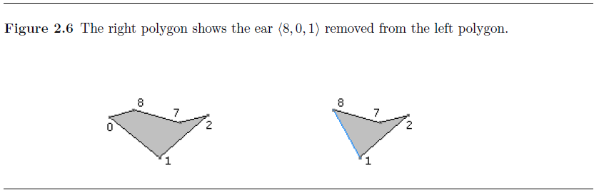
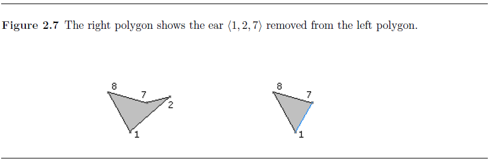
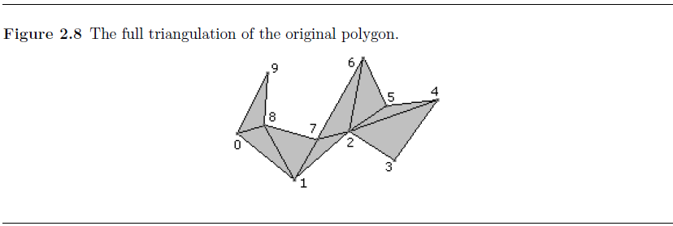

# earClipping
将简单多边形转换成一组由同样顶点组成的三角形集合
****
[Triangulation by Ear Clipping](https://blog.csdn.net/u012871784/article/details/50418817)

[Polygon Area](https://mathworld.wolfram.com/PolygonArea.html)

[determining-the-winding-of-a-polygon-given-as-a-set-of-ordered-points](https://www.element84.com/blog/determining-the-winding-of-a-polygon-given-as-a-set-of-ordered-points)
****
## 简单多边形定义：
1. 由一组**有序的n个顶点**(v0,v1,...,vn-1)组成的
2. 相邻顶点之间通过边($v_i$,vi+1)(0≤i≤n-2)相连
3. 边(vn-1,v0)连接起始点
4. 每个顶点被两条边所共享，而边的所有交点都是顶点。
   
****
## 判断方法
一个n边形有n条边，每条边只需要和其他的n-3条不相邻边判断是否相交即可。

其时间复杂度O(n2)
## 多边形的三角形化（triangulation of the Polygon）
将一个**简单多边形**分解成三角形集合的方法称为多边形三角化。

由n个顶点组成的简单多边形问题可以分解为n-2个三角形。

最简单的分割算法是**耳剪裁（EarClipping）**，算法复杂度O(n2)
****
## Ear Clipping
简单多边形的**耳朵**，是指轴连续顶点V0V1V2组成的内部不包含其他任意顶点的三角形。V0V2之间的连线称之为多边形的对角线，顶点V1称之为**耳尖**

一个由四个顶点（或者更多顶点）组成的多边形至少有两个不重叠的耳尖。这个特性提供了一个通过递归来解决三角化分割的方法。针对由n个顶点组成的简单多边形，找到其耳尖，移除唯一耳尖上的顶点，此时剩余顶点组成了一个n-1个顶点的简单多边形。我们重复这个操作后剩余3个顶点。这样会产生一个复杂度为O(n3)的算法

耳朵消除可以在O(n2)的时间内来完成，

第1步，将多边形使用**双向链表**存储，这样可以快速的移除耳朵。列表的构建复杂度是O(n)。

第2步，遍历顶点寻找耳朵。对于每一个顶点Vi和围绕该顶点的三角形Vi-1ViVi+1测试其它顶点是否在当前，如果有一个顶点在三角形里面，则不是耳朵。只有都不在里面的情况下才算找到一个耳朵。

具体实现的时候我们可以考虑以下因素让这个算法更为高效：当发现有一个点在里面的时候便可以放弃当前测试。一个凹拐角其两边的夹角大于180o，而一个凸拐角两边夹角小于180o。存储多边形的数据结构使用4个链表，具体使用数组而不是标准的动态需要分配和释放存储器的链表。多边形的顶点存储在一个循环链表中，凹顶点和凸顶点存储在线型链表中，耳尖存储在一个循环链表中。

一旦凸顶点和耳朵的链表构建成功，每次遍历都会移除一个耳朵。假设当前Vi是个耳朵并且被移除掉，那么边结构的相邻点Vi-1,Vi+1则会发生变化，如果相邻点是凸顶点，那么依旧保持凸点，如果相邻点是个耳朵，那么当顶点Vi被移除后不一定能保持耳朵状态，如果相邻点是个凹点，那么他则有可能变为一个凸点甚至耳朵。因此当移除顶点Vi后，如果相邻点是凸点，则必须遍历相关顶点，通过遍历查看是否包含其它点来测试它是否是一个耳朵。我们有n个耳朵，每一次更新才会触发一个耳朵检测，每次过程中更新O(n)，所以移除进程的复杂度是O(n2)

0. 初始时
    凸顶点集合C={0,1,3,4,6,9};

    凹顶点集合R={2,5,7,8};

    耳朵集合E={3,4,6,9}

1. 当顶点3被移除时，其对应耳朵的三角形T0={2,3,4}，图2.1右侧展示了改进后的多边形的效果。相邻点2是个凹点，变化后依旧是凹点，顶点4是耳朵，现在依旧是耳朵。
    
    图中右侧多边形展示了三角形T0={2,3,4}被移除后的效果
    
    
    凸顶点集合C={0,1,*~~3~~*,4,6,9};

    凹顶点集合R={2,5,7,8};
    
    耳朵集合E={*~~3~~*,4,6,9} // 3已经被移除

    
2. 继续移除顶点4，其对应耳朵的三角形T1={2,4,5}
   
   图2.2右侧多边形展示移除三角形T1={2,4,5}后的效果
   

   相邻顶点2仍旧保持凹点，相邻5之前是凹点，现在变成了凸点，经过测试最终发现它是个耳朵。因此顶点列表最终的变化结果是

   凹顶点集合R={2,*~~5~~*,7,8}

   耳朵集合E={*~~4~~*, **5**,6,9}

3. 继续移除顶点5，此时对应三角形T2={2,5,6}。
   图2.3展示了移除三角形T2={2,5,6}后的效果
    

   相邻顶点2原来是个凹点，现在变成凸点，顶点7位于三角形T={1,2,6}内，所以2不是耳朵。所以操作完后各顶点列表

   凹顶点集合R={*~~2~~*,7,8}

   耳朵集合E={*~~5~~*,6,9}

4. 继续移除顶点6，此时应对三角形T3={2,6,7}
   图2.4展示了移除三角形T3={2,6,7}后的效果
   

   相邻顶点2是一个凸顶点，但是它由一个非耳朵变成了耳朵顶点。相邻顶点7和8依旧是凹顶点，因此凹顶点集合保持不变。结果：
   
   凹顶点集合R={*~~2~~*,7,8}

   耳朵集合E={*~~6~~*,9,**2**}
5. 继续移除顶点9，对应三角形T4={8,9,0}
   
   

   相邻顶点8是个凹顶点，但它现在变成了凸顶点，并且是一个耳朵，相邻顶点0是个凸顶点，保持依旧，并且由非耳朵变成了耳朵。

   凹顶点集合R={7, *~~8~~*}

   耳朵集合E={**0**,*~~9~~*,2,**8**}
6. 移除顶点0对应三角形T5={8,0,1}
   
   

   相邻顶点8和1依旧是凸顶点，顶点8依旧是个耳朵，顶点1依旧不是耳朵。
    
   凹顶点集合R={7}

   耳朵集合E={**~~0~~**,2,**8**}
7. 移除耳朵顶点2，对应的三角形T6={1,2,7}
   
   

    到现在，已经没有在需要更新的凹点和耳朵列表，到此为止我们只剩下了三个顶点，这三个顶点组成最后的三角形T7=<7,8,1>。
8. 所有的三角形分割线是如图2.8
   
   

